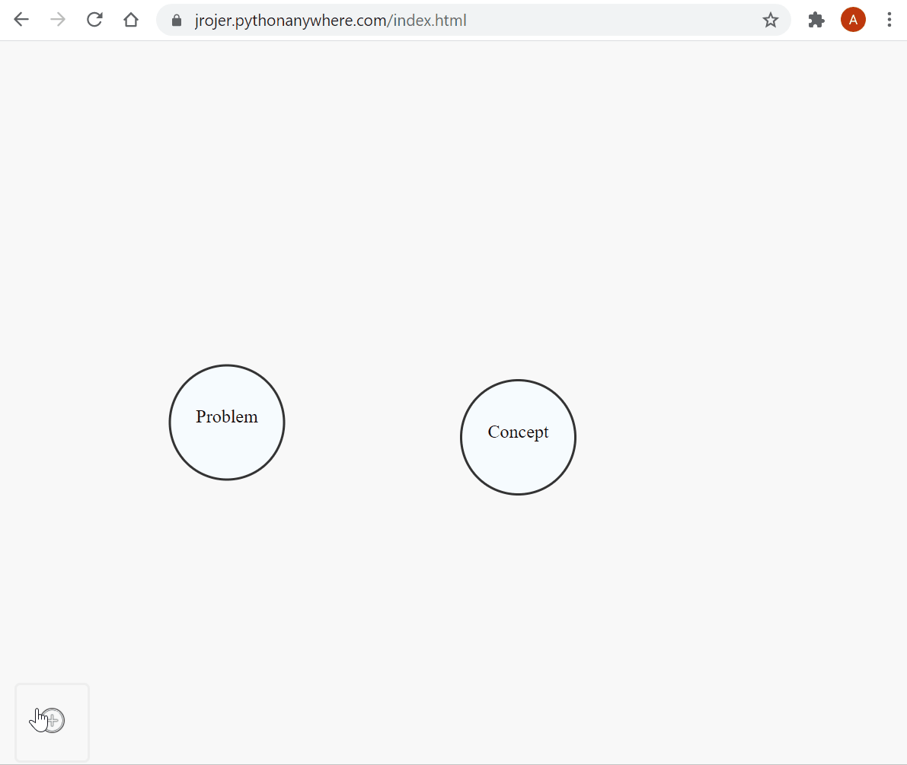

Store your Markdown notes in Directed acyclic graph (DAG).  
Thanks to:
 * https://bl.ocks.org/cjrd/6863459
 * http://bl.ocks.org/fancellu/2c782394602a93921faff74e594d1bb1
 * https://github.com/sparksuite/simplemde-markdown-editor

[Demo.](https://jrojer.pythonanywhere.com/index.html)